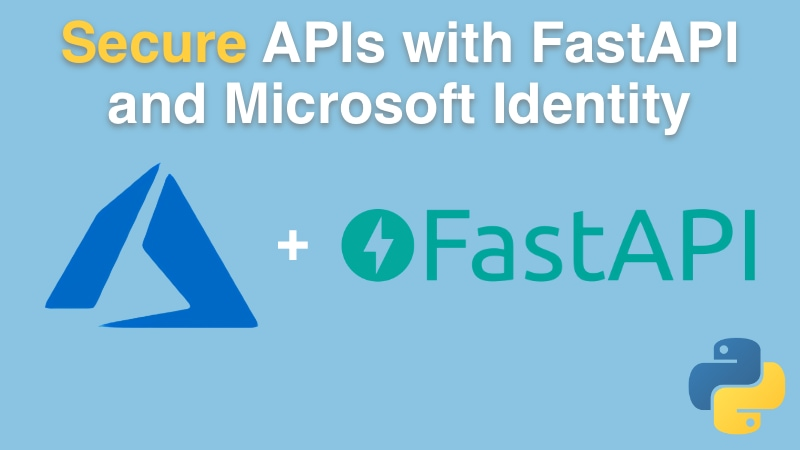

# [Secure APIs with FastAPI and the Microsoft Identity Platform Course](https://talkpython.fm/fastapi-azure-ad)

## Course Summary

Azure Active Directory (Azure AD) is a cloud-based Identity and Access Management service from Microsoft. With security threats on the rise it’s important to know how to build secure solutions with robust authentication and authorization services to protect your data. In this course we will introduce basic identity principals and learn how to use Azure AD to enforce who and how they can access our Fast APIs using open industry standards such as OAuth2 and OIDC.

If you are a Python developer that wants to know how to implement secure, JWT-based authentication and authorization by leveraging a scalable, secure and flexible identity provider such Azure AD, then this course is for you. You will learn how to secure your APIs without the need to write too much code or having intricate knowledge on how OAuth2 and OIDC work. A plug and play solution for every Python developer and solution architect out there.

## What topics are covered?

In this course, you will:

- **Learn what Identity is** and why modern solutions need to know who we are and what we can do.
- **Understand modern authentication** and why we needed open standards such OAuth2 and OpenID Connect (OIDC).
- Learn how to create and **work with Microsoft Azure Active Directory**.
- Take a look at the `microsoft_identity_fastapi` package built specifically to perform authorization and token validation in FastAPI-based solutions.
- Dive deep into **JWT-based authentication** and better understand tokens and claims.
- And lots more.

## Take the course

[Visit the course page for full details and to sign up](https://talkpython.fm/fastapi-azure-ad).